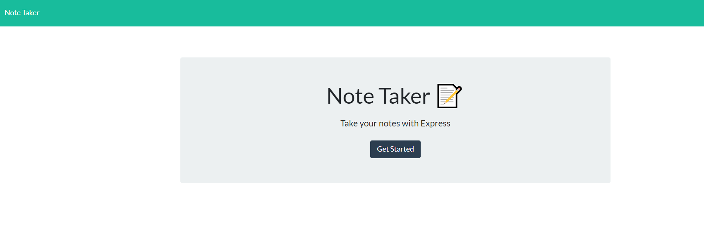
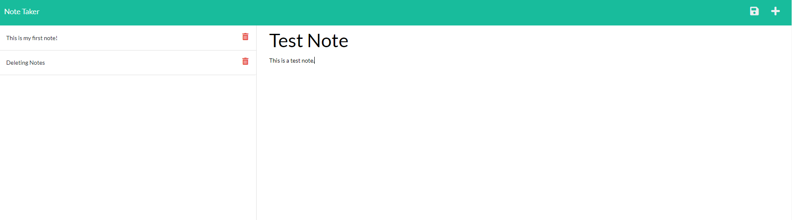
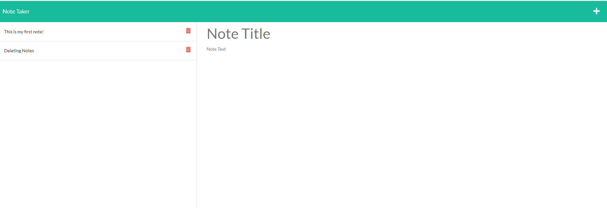

# 11-Note-Taker

## Description

This is a Express JS Note Taker application that allows a user to take notes and view a list of the notes. The application also provides the ability to delete the notes. On clicking an existing note, the note title and text are visible.

## Table of contents

- [Installation](#installation)
- [Usage](#usage)
- [License](#license)
- [Contributors](#contributors)
- [Test](#test)
- [Questions](#questions)

## Installation

There are no files to download for this project.

The packages required to run are:

-Express JS
-fs
-path

## Usage

To start the process, go to the deployed site [here](https://sampreeti-11-note-taker.herokuapp.com/)

## License

This project is licensed under the MIT license.

## Contributors

Sampreeti Das

## Test

To run the test, please go to the deployed site [here](https://sampreeti-11-note-taker.herokuapp.com/)

## Questions

If you have any questions please contact sghosh17 directly at sampreetighosh@gmail.com.
